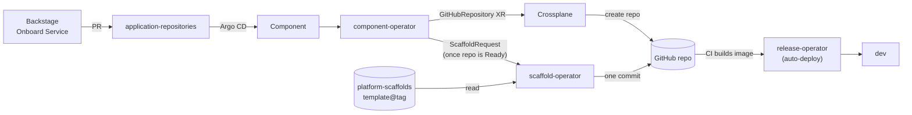
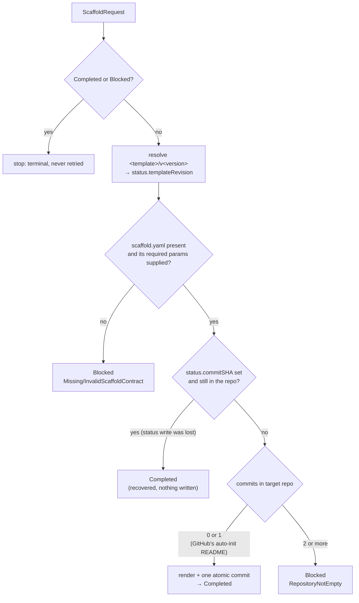
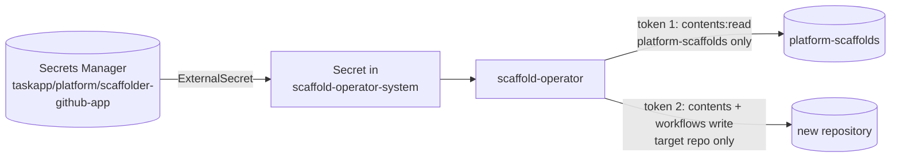
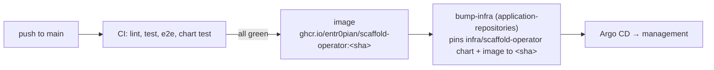

# scaffold-operator

Renders a [`platform-scaffolds`](https://github.com/entr0pian/platform-scaffolds)
template into a newly created GitHub repository as **one commit**, exactly
once. It executes the `ScaffoldRequest` API (`scaffold.taskapp.io/v1alpha1`)
and runs on the `management` cluster.

## Where it fits

Onboarding a service creates a `Component`. Every step after that is automated:



The split is deliberate:

- **component-operator decides *what* and *when*.** It writes a
  self-contained `ScaffoldRequest`, and owns it, so deleting the
  `Component` deletes the request.
- **scaffold-operator only *executes*.** It never reads `Component`.
  Everything it needs is in the request's `spec`.

## The API

```yaml
apiVersion: scaffold.taskapp.io/v1alpha1
kind: ScaffoldRequest
metadata:
  name: payments
spec:
  componentRef: {name: payments}
  componentName: payments      # service / chart / resource names
  repositoryName: payments     # target GitHub repository
  owner: entr0pian             # GitHub account of the repository
  componentOwner: team-payments  # catalog-info.yaml spec.owner
  template: golang-service     # templates/<template>/ in platform-scaffolds
  version: "0.12.0"            # resolved as tag <template>/v<version>
status:
  templateRevision: <sha>      # exact platform-scaffolds commit used
  commitSHA: <sha>             # the scaffold commit in the target repo
  conditions: [Completed | Blocked]
```

## How a request is executed



- **Rendering:** `.tpl` files get the suffix stripped and exact
  `{{ paramName }}` placeholders replaced. All other files are copied
  byte for byte, so the scaffold's own Helm and Actions `{{ }}` syntax
  is never touched.
- **One commit:** the files are written through the Git Data API (blobs →
  tree → commit → ref) on the repository's real default branch. Crossplane
  `RepositoryFile` resources would make one commit per file instead.
- **Safety:** the operator never overwrites content it can't prove it
  wrote. A `Blocked` request needs a person to fix the repository and then
  recreate the request.
- **No updates:** an already scaffolded repository is never migrated to a
  newer template version.

## GitHub access

The operator authenticates as its own GitHub App, **`taskapp-platform-scaffolder`**.
The App has Contents and Workflows read/write, and is installed on all
repositories so a repository Crossplane just created is covered.
Commits are authored by `taskapp-platform-scaffolder[bot]`.



- **Short-lived tokens:** each token lasts at most an hour, and each is
  narrower than the App.
- **Workflows permission:** templates commit `.github/workflows/*`, and
  GitHub rejects that from an App token without workflows write.
- **Secret ownership:** `bootstrap-cluster/terraform/management-eks` owns
  the secret.
- **`--github-auth=pat`:** reads the shared
  `crossplane-system/crossplane-github-credentials` token instead. It exists
  only for kind-based CI and e2e, which have no External Secrets. The
  operator never falls back from the App to the PAT.

## Deployment



The Helm chart in `chart/` is what gets deployed. `config/` (kustomize) is
used only for local and e2e deploys.

| Chart value | Default | |
|---|---|---|
| `github.auth` | `app` | `app` or `pat` |
| `github.app.secretPath` | `taskapp/platform/scaffolder-github-app` | Secrets Manager key |
| `github.app.clusterSecretStoreName` | `aws-secrets-manager` | ESO store |

## Development

```sh
make test       # unit + envtest (GitHub is stubbed)
make lint
make test-e2e   # kind cluster
go run ./cmd/main.go --github-auth=pat   # against your current kubeconfig
```

The API is defined in `api/v1alpha1/`. After changing it, run
`make manifests generate`, then mirror the new
`config/crd/bases` CRD into `chart/templates/crd/` (keep its Helm `if` wrapper).

## License

Apache 2.0. See the header in any source file.
